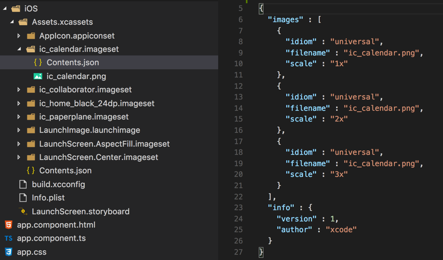
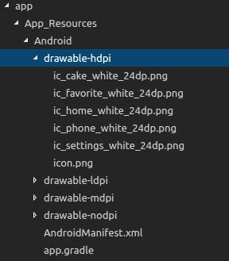

[](https://www.npmjs.com/package/nativescript-bottombar)
[](https://www.npmjs.com/package/nativescript-bottombar)

# NativeScript BottomBar :beers::fire::fr:

NativeScript plugin for [AHBottomNavigation](https://github.com/aurelhubert/ahbottomnavigation) and [MiniTabBar](https://github.com/D-32/MiniTabBar).

Checkout [demo](https://github.com/rhanbIT/nativescript-bottombar/blob/master/DEMO.md).

## Installation

- 2.x: `tns plugin add nativescript-bottombar@^2.1`

- 3.x: `tns plugin add nativescript-bottombar`

# Usage

[API documentation](https://github.com/rhanbIT/nativescript-bottombar/blob/master/API.md)

## Angular NativeScript

### XML
   
```xml
<GridLayout rows="*, auto">
    <StackLayout row="0" orientation="vertical">
       <Label text="demo"></Label>
    </StackLayout>
    <BottomBar row="1" [items]="items" [hide]="hidden" [titleState]="titleState" (loaded)="tabLoaded($event)" (tabSelected)="tabSelected($event)" [inactiveColor]="inactiveColor" [accentColor]="accentColor" colored="true"></BottomBar>
</GridLayout>
```
### Component

```typescript
import { Component } from "@angular/core";
import { registerElement } from 'nativescript-angular';
import { BottomBar, BottomBarItem, TITLE_STATE, SelectedIndexChangedEventData, Notification } from 'nativescript-bottombar';

registerElement('BottomBar', () => BottomBar);

@Component({
    selector: "nsapp",
    templateUrl: "app.component.html",
})

export class AppComponent {
    public hidden: boolean;
    public titleState: TITLE_STATE;
    public _bar: BottomBar;
    public inactiveColor: string;
    public accentColor: string;

    public items: Array<BottomBarItem> = [
        new BottomBarItem(0, "Home", "ic_home_black_24dp", "black", new Notification("blue", "white", "1")),
        new BottomBarItem(1, "Calendar", "ic_calendar", "#1083BF", new Notification("green", "blue", "1")),
        new BottomBarItem(2, "Profile", "ic_collaborator", "pink", new Notification("pink", "yellow", "1")),
        new BottomBarItem(3, "Message", "ic_paperplane", "green", new Notification("green", "red", "1"))
    ];

    tabLoaded(event) {
        this._bar = <BottomBar>event.object;
        this.hidden = false;
        this.titleState = TITLE_STATE.SHOW_WHEN_ACTIVE;
        this.inactiveColor = "white";
        this.accentColor = "blue";
    }
    
     tabSelected(args: SelectedIndexChangedEventData) {
         // only triggered when a different tab is tapped
         console.log(args.newIndex);
     }
}
```
# Ressources

Don't forget that you need your icons files to be in your ressources folder as follow:


  iOS    |  Android
-------- | ---------
 | 

[API documentation](https://github.com/rhanbIT/nativescript-bottombar/blob/master/API.md)
